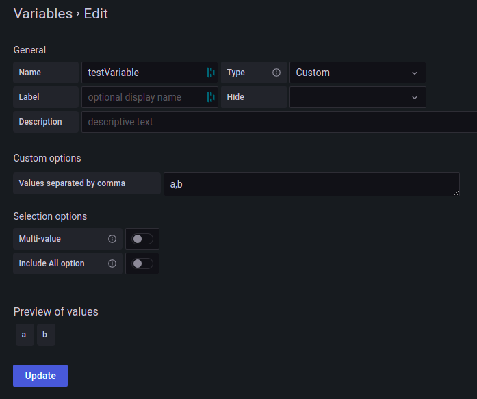

:::info
Huge thanks to [letshin](https://github.com/letshin) for the [original post](https://github.com/gapitio/gapit-htmlgraphics-panel/issues/152).
:::


:::caution
For Grafana v8.3.0+ variables used by HTMLGraphics won't update when the variable is changed unless it's wrapped in `${}`.
:::



`HTML/SVG`

```html
<svg width="100" height="100">
  <circle cx="50" cy="50" r="40" stroke="turquoise" stroke-width="4" fill="red" />
</svg>
```

`onInit`

```javascript
// For Grafana v8.3.0+ the variable needs to be wrapped in ${}
const { testVariable } = customProperties;
const testVariableName = testVariable.replace(/[${}]/g, '');

const circleElt = htmlNode.querySelector('circle');

function getGrafanaVariableValue(variable) {
  return getTemplateSrv().replace(variable);
}

htmlNode.addEventListener('panelupdate', () => {
  if (getGrafanaVariableValue(testVariable) == 'a') {
    circleElt.setAttribute('fill', 'blue');
  } else {
    circleElt.setAttribute('fill', 'green');
  }
});
```

`Custom properties`

```json
{
  "testVariable": "${testVariable}"
}
```

`Panel options` (import/export)

```json
{
  "calcsMutation": "standard",
  "add100Percentage": true,
  "centerAlignContent": true,
  "overflow": "visible",
  "useGrafanaScrollbar": true,
  "SVGBaseFix": true,
  "codeData": "{\n  \"testVariable\": \"${testVariable}\"\n}",
  "rootCSS": "",
  "css": "",
  "html": "<svg width=\"100\" height=\"100\">\n  <circle cx=\"50\" cy=\"50\" r=\"40\" stroke=\"turquoise\" stroke-width=\"4\" fill=\"red\" />\n</svg>\n",
  "renderOnMount": true,
  "onRender": "",
  "panelupdateOnMount": true,
  "dynamicHtmlGraphics": false,
  "dynamicData": false,
  "dynamicFieldDisplayValues": false,
  "dynamicProps": false,
  "onInitOnResize": false,
  "onInit": "// For Grafana v8.3.0+ the variable needs to be wrapped in ${}\nconst { testVariable } = customProperties;\nconst testVariableName = testVariable.replace(/[${}]/g, '');\n\nconst circleElt = htmlNode.querySelector('circle');\n\nfunction getGrafanaVariableValue(variable) {\n  return getTemplateSrv().replace(variable);\n}\n\nhtmlNode.addEventListener('panelupdate', () => {\n  if (getGrafanaVariableValue(testVariable) == 'a'){\n    circleElt.setAttribute('fill', 'blue');\n  } else {\n    circleElt.setAttribute('fill', 'green');\n  }\n});\n"
}
```
