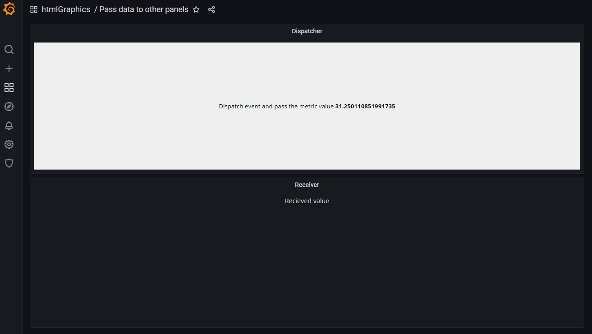

Send data from one panel to a different one.



This uses [CustomEvent](https://developer.mozilla.org/en-US/docs/Web/API/CustomEvent) to dispatch events to the [document](https://developer.mozilla.org/en-US/docs/Web/API/Document). Which makes it available for all panels if they listen to the `htmlGraphics` event.

## Dispatcher

`HTML/SVG`

```html
<button>Dispatch event and pass the metric value <strong /></button>
```

`onRender`

```js
// Sets the value from the first series on every refresh
const htmlgraphicsValue = htmlNode.querySelector('strong');

if (htmlgraphicsValue) {
  const valueField = data.series[0]?.fields[1];
  if (valueField) {
    const length = valueField.values.length;
    htmlgraphicsValue.textContent = valueField.values.get(length - 1);
  } else {
    htmlgraphicsValue.textContent = 'No data';
  }
}
```

`onInit`

```js
const buttonElt = htmlNode.querySelector('button');
const valueElt = htmlNode.querySelector('strong');

buttonElt.onclick = () => {
  htmlGraphicsEvent = new CustomEvent('htmlgraphics', { detail: valueElt.textContent });
  document.dispatchEvent(htmlGraphicsEvent);
};
```

`Panel options` (import/export)

```json
{
  "calcsMutation": "standard",
  "reduceOptions": {
    "calcs": [
      "lastNotNull",
      "last",
      "first",
      "firstNotNull",
      "min",
      "max",
      "mean",
      "sum",
      "count",
      "range",
      "delta",
      "step",
      "diff",
      "logmin",
      "allIsZero",
      "allIsNull",
      "diffperc"
    ]
  },
  "add100Percentage": true,
  "centerAlignContent": true,
  "overflow": "visible",
  "SVGBaseFix": true,
  "codeData": "{\n  \"text\": \"Random text\"\n}",
  "rootCSS": "",
  "css": "* {\n  font-family: Open Sans;\n}\n",
  "html": "<button>Dispatch event and pass the metric value <strong /></button>\n",
  "renderOnMount": true,
  "onRender": "// Sets the value from the first series on every refresh\nconst htmlgraphicsValue = htmlNode.querySelector(\"strong\");\n\nif (htmlgraphicsValue) {\n  const valueField = data.series[0]?.fields[1];\n  if (valueField) {\n    const length = valueField.values.length;\n    htmlgraphicsValue.textContent = valueField.values.get(length - 1);\n  } else {\n    htmlgraphicsValue.textContent = \"No data\"\n  }\n}\n",
  "dynamicData": false,
  "dynamicHtmlGraphics": false,
  "dynamicFieldDisplayValues": false,
  "dynamicProps": false,
  "panelupdateOnMount": true,
  "onInit": "const buttonElt = htmlNode.querySelector(\"button\");\nconst valueElt = htmlNode.querySelector(\"strong\");\n\nbuttonElt.onclick = () => {\n  htmlGraphicsEvent = new CustomEvent(\"htmlgraphics\", { detail: valueElt.textContent });\n  document.dispatchEvent(htmlGraphicsEvent);\n};\n"
}
```

## Receiver

`HTML/SVG`

```html
<div style="text-align: center;">Recieved value <strong /></div>
```

`onInit`

```js
const valueElt = htmlNode.querySelector('strong');

const doSomething = (e) => {
  const value = e.detail;
  valueElt.textContent = value;
};

document.addEventListener('htmlgraphics', doSomething);

htmlNode.onpanelwillunmount = () => {
  document.removeEventListener('htmlgraphics', doSomething);
};
```

`Panel options` (import/export)

```json
{
  "calcsMutation": "standard",
  "reduceOptions": {
    "calcs": [
      "lastNotNull",
      "last",
      "first",
      "firstNotNull",
      "min",
      "max",
      "mean",
      "sum",
      "count",
      "range",
      "delta",
      "step",
      "diff",
      "logmin",
      "allIsZero",
      "allIsNull",
      "diffperc"
    ]
  },
  "add100Percentage": true,
  "centerAlignContent": true,
  "overflow": "visible",
  "SVGBaseFix": true,
  "codeData": "{\n  \"text\": \"Random text\"\n}",
  "rootCSS": "",
  "css": "* {\n  font-family: Open Sans;\n}\n",
  "html": "<div style=\"text-align: center;\">Recieved value <strong /></div>",
  "renderOnMount": true,
  "onRender": "",
  "dynamicData": false,
  "dynamicHtmlGraphics": false,
  "dynamicFieldDisplayValues": false,
  "dynamicProps": false,
  "panelupdateOnMount": true,
  "onInit": "const valueElt = htmlNode.querySelector(\"strong\");\n\n\nconst doSomething = (e) => {\n  const value = e.detail;\n  valueElt.textContent = value;\n};\n\ndocument.addEventListener(\"htmlgraphics\", doSomething);\n\nhtmlNode.onpanelwillunmount = () => {\n  document.removeEventListener(\"htmlgraphics\", doSomething);\n};\n"
}
```
