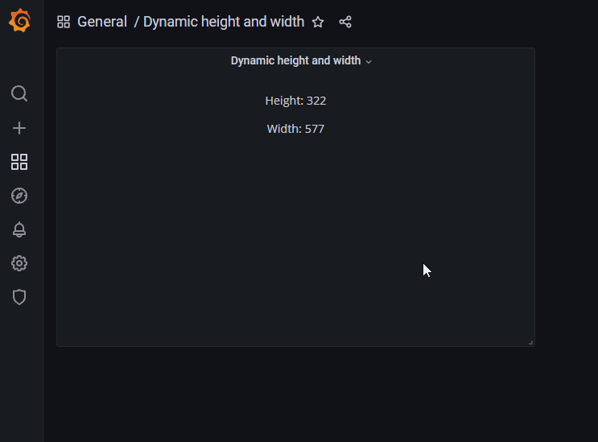

`CSS`

```css
* {
  font-family: Open Sans;
}

div {
  text-align: center;
}
```

`HTML/SVG`

```html
<div>
  <p><span>Height: </span><span class="value-field" /></p>
  <p><span>Width: </span><span class="value-field" /></p>
</div>
```

`onInit`

```js
// REMEMBER TO TURN DYNAMIC HTMLGRAPHICS TO TRUE

const [heightValueElt, widthValueElt] = htmlNode.querySelectorAll('.value-field');

// Used to store the initial
const storedPanelSize = {
  height: htmlGraphics.height,
  width: htmlGraphics.width,
};

const updateValueText = () => {
  // Important that htmlGraphics.height or width is used inside the function.
  // If height or width is destructured outside the function they will not get the new height.
  heightValueElt.textContent = htmlGraphics.height;
  widthValueElt.textContent = htmlGraphics.width;
};

const updateStoredPanelSize = () => {
  storedPanelSize.height = htmlGraphics.height;
  storedPanelSize.width = htmlGraphics.width;
};

// Show the height and width right away.
updateValueText();

htmlNode.onpanelupdate = () => {
  const isPanelSizeUpdate = !(
    htmlGraphics.height == storedPanelSize.height && htmlGraphics.width === storedPanelSize.width
  );

  if (isPanelSizeUpdate) {
    updateValueText();

    // Update the previous stored values with the new height and witdth
    updateStoredPanelSize();
  }
};
```

`Panel options` (import/export)

```json
{
  "calcsMutation": "standard",
  "reduceOptions": {
    "calcs": [
      "lastNotNull",
      "last",
      "first",
      "firstNotNull",
      "min",
      "max",
      "mean",
      "sum",
      "count",
      "range",
      "delta",
      "step",
      "diff",
      "logmin",
      "allIsZero",
      "allIsNull",
      "diffperc"
    ]
  },
  "add100Percentage": true,
  "centerAlignContent": true,
  "overflow": "visible",
  "SVGBaseFix": true,
  "codeData": "{\n  \"text\": \"Random text\"\n}",
  "rootCSS": "",
  "css": "* {\n  font-family: Open Sans;\n}\n\ndiv {\n  text-align: center;\n}",
  "html": "<div>\n  <p><span>Height: </span><span class=\"value-field\" /></p>\n  <p><span>Width: </span><span class=\"value-field\" /></p>\n</div>\n",
  "renderOnMount": true,
  "onRender": "",
  "dynamicData": false,
  "dynamicHtmlGraphics": true,
  "dynamicFieldDisplayValues": false,
  "dynamicProps": false,
  "panelupdateOnMount": true,
  "onInit": "// REMEMBER TO TURN DYNAMIC HTMLGRAPHICS TO TRUE\n\nconst [heightValueElt, widthValueElt] = htmlNode.querySelectorAll(\".value-field\");\n\n// Used to store the initial \nconst storedPanelSize = {\n  height: htmlGraphics.height,\n  width: htmlGraphics.width\n}\n\nconst updateValueText = () => {\n  // Important that htmlGraphics.height or width is used inside the function.\n  // If height or width is destructured outside the function they will not get the new height.\n  heightValueElt.textContent = htmlGraphics.height;\n  widthValueElt.textContent = htmlGraphics.width;\n}\n\nconst updateStoredPanelSize = () => {\n  storedPanelSize.height = htmlGraphics.height;\n  storedPanelSize.width = htmlGraphics.width;\n}\n\n// Show the height and width right away.\nupdateValueText();\n\nhtmlNode.onpanelupdate = () => {\n  const isPanelSizeUpdate = !(htmlGraphics.height == storedPanelSize.height && htmlGraphics.width === storedPanelSize.width);\n\n  if (isPanelSizeUpdate) {\n    updateValueText();\n\n    // Update the previous stored values with the new height and witdth\n    updateStoredPanelSize();\n  }\n}\n"
}
```
