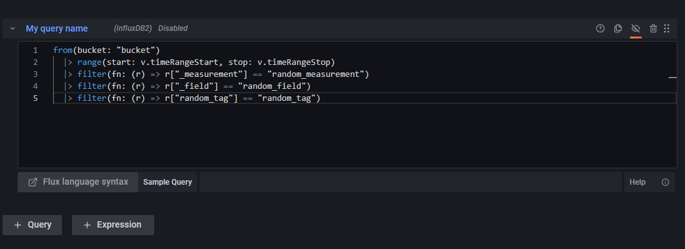

:::info
Huge thanks to [neshorg](https://github.com/neshorg) ([Grafana profile](https://community.grafana.com/u/neshorg/)) for the [original post](https://community.grafana.com/t/download-csv-button/38688/6?u=zuperzee).
:::


## Check out examples based on specific data sources

- [Influx 2](./influx2.md)
- [Influx 1.8](./influx1.8.md)

:::note
Most data sources should work with some tweaks
:::

This works by extracting the targets using the [data object](../../references.md#data-global), making it possible to use _most_ data sources provided by Grafana _with some tweaks_.

:::tip
The query can be "hidden" by pressing the "Enable/disable query" button _(small eye icon)_. Which will disable the query (for better performance).
:::

**Remember to add a query!!!**

An example query using the influx database:


Below is a basic example of how to approach implementing the code.

The code requires the query to be sent, where to send the query, converting the retrieved data to CSV, and a way to execute it.

## Query to be sent

The query and most of the additional data can be obtained from [DataQueryRequest interface `data.request.targets`](https://grafana.com/docs/grafana/v9.1/packages_api/data/dataqueryrequest/).

```js
const [{ query, refId, datasource }] = data.request.targets;
const { from, to } = data.timeRange;
```

## Where to send the query

Most data sources use [/api/datasources/proxy/:datasourceId/\*](https://grafana.com/docs/grafana/v9.1/http_api/data_source/#data-source-proxy-calls), [/api/ds/query](https://grafana.com/docs/grafana/v9.1/http_api/data_source/#data-source-proxy-calls) and the deprecated [/api/tsdb/query](https://grafana.com/docs/grafana/v9.1/http_api/data_source/#query-a-data-source-by-id).

The approach is usually the same for the APIs, but data sources require different data.

Using the [/api/ds/query](https://grafana.com/docs/grafana/v9.1/http_api/data_source/#data-source-proxy-calls)

```js
const { from, to } = data.timeRange;

const body = { stuff: 'Some random data based on the data source' };

fetch('/api/ds/query', {
  headers: {
    'cache-control': 'no-cache',
    'content-type': 'application/json',
  },
  body: JSON.stringify(body),
  method: 'POST',
});
```
