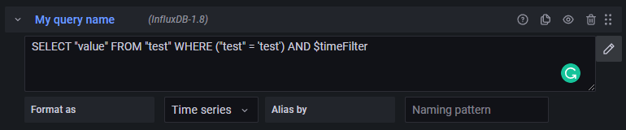

:::info
Check out the [Export to CSV index page](../export-to-csv/index.md) for a more detailed explanation of the approach
:::


This works by using the [data object](../../references.md#data-global), which makes it possible to use _most_ data sources provided by Grafana.

:::tip
The query can be "hidden" by pressing the "Enable/disable query" button _(small eye icon)_. Which will disable the query (for better performance).
:::

**Remember to add a query!!!**

Example query using the influx1.8 database:


`HTML/SVG`

```html
<button>Export to CSV</button>
```

`onInit`

```javascript
const btn = htmlNode.querySelector('button');

const timeoutLength = 3000;
const defaultButtonText = 'Export to CSV';

const toCsv = (resultsData) => {
  const [
    {
      series: [{ columns, values }],
    },
  ] = Object.values(resultsData.results);

  if (values.length <= 0 || columns.length <= 0) {
    btn.textContent = 'Export failed... (Found no values).';
    console.warn('Got no values');
    return;
  }

  const csv = [
    columns.join(','),
    ...values.map((v) => {
      const [timeField, ...rest] = v;
      const time = new Date(timeField).toISOString();
      return [time, ...rest].join(',');
    }),
  ].join('\r\n');

  return csv;
};

const saveCsvFile = (csv, filename) => {
  const elt = document.createElement('a');
  elt.setAttribute('href', 'data:text/csv;charset=utf-8,' + encodeURIComponent(csv));
  elt.setAttribute('download', filename);
  elt.style.display = 'none';
  htmlNode.appendChild(elt);
  elt.click();
  htmlNode.removeChild(elt);
};

btn.onclick = () => {
  clearTimeout(btn.timeout);
  btn.textContent = 'Exporting...';
  // The refId (query name) only updates after a page refresh.
  const [{ query, refId, datasource }] = data.request.targets;
  const { from, to } = data.timeRange;
  const datasourceData = Object.values(grafanaBootData.settings.datasources).find((d) => d.uid === datasource.uid);
  const datasourceUrl = datasourceData.url;
  const db = datasourceData.database;
  const timeFilter = data.request.scopedVars.timeFilter.value;
  const q = getTemplateSrv().replace(query).replace('$timeFilter', timeFilter);

  const filename = [refId, from.toISOString(), to.toISOString()].join('-') + '.csv';

  const params = new URLSearchParams({
    db: db,
    q: q,
    epoch: 'ms',
  });

  fetch(datasourceUrl + '/query?' + params.toString(), {
    headers: {
      'cache-control': 'no-cache',
    },
  })
    .then((res) => res.json())
    .then((data) => {
      const csv = toCsv(data);
      if (csv) {
        saveCsvFile(toCsv(data), filename);
        btn.textContent = 'Export finished';
      }

      btn.timeout = setTimeout(() => {
        btn.textContent = defaultButtonText;
      }, timeoutLength);
    })
    .catch((e) => {
      btn.textContent = 'Export failed... (Failed retrieving data)';
      console.warn(e);

      btn.timeout = setTimeout(() => {
        btn.textContent = defaultButtonText;
      }, timeoutLength);
    });
};
```

`Panel options` (import/export)

```json
{
  "add100Percentage": true,
  "centerAlignContent": true,
  "overflow": "visible",
  "SVGBaseFix": true,
  "codeData": "{\n  \"text\": \"Random text\"\n}",
  "rootCSS": "",
  "css": "* {\n  font-family: Open Sans;\n}\n",
  "html": "<button>Export to CSV</button>",
  "renderOnMount": true,
  "onRender": "",
  "dynamicHtmlGraphics": false,
  "dynamicData": true,
  "dynamicFieldDisplayValues": false,
  "dynamicProps": false,
  "panelupdateOnMount": true,
  "onInitOnResize": false,
  "onInit": "const btn = htmlNode.querySelector(\"button\");\n\nconst timeoutLength = 3000;\nconst defaultButtonText = \"Export to CSV\";\n\nconst toCsv = (resultsData) => {\n  const [\n    {\n      series: [{ columns, values }],\n    },\n  ] = Object.values(resultsData.results);\n\n  if (values.length <= 0 || columns.length <= 0) {\n    btn.textContent = \"Export failed... (Found no values).\";\n    console.warn(\"Got no values\");\n    return;\n  }\n\n  const csv = [\n    columns.join(\",\"),\n    ...values.map((v) => {\n      const [timeField, ...rest] = v;\n      const time = new Date(timeField).toISOString();\n      return [time, ...rest].join(\",\");\n    }),\n  ].join(\"\\r\\n\");;\n\n  return csv;\n};\n\nconst saveCsvFile = (csv, filename) => {\n  const elt = document.createElement(\"a\");\n  elt.setAttribute(\n    \"href\",\n    \"data:text/csv;charset=utf-8,\" + encodeURIComponent(csv)\n  );\n  elt.setAttribute(\"download\", filename);\n  elt.style.display = \"none\";\n  htmlNode.appendChild(elt);\n  elt.click();\n  htmlNode.removeChild(elt);\n};\n\nbtn.onclick = () => {\n  clearTimeout(btn.timeout);\n  btn.textContent = \"Exporting...\";\n  // The refId (query name) only updates after a page refresh.\n  const [{ query, refId, datasource }] = data.request.targets;\n  const { from, to } = data.timeRange;\n  const datasourceData = Object.values(\n    grafanaBootData.settings.datasources\n  ).find((d) => d.uid === datasource.uid);\n  const datasourceUrl = datasourceData.url;\n  const db = datasourceData.database;\n  const timeFilter = data.request.scopedVars.timeFilter.value;\n  const q = getTemplateSrv().replace(query).replace(\"$timeFilter\", timeFilter);\n\n  const filename =\n    [refId, from.toISOString(), to.toISOString()].join(\"-\") + \".csv\";\n\n  const params = new URLSearchParams({\n    db: db,\n    q: q,\n    epoch: \"ms\",\n  });\n\n  fetch(datasourceUrl + \"/query?\" + params.toString(), {\n    headers: {\n      \"cache-control\": \"no-cache\",\n    },\n  })\n    .then((res) => res.json())\n    .then((data) => {\n      const csv = toCsv(data);\n      if (csv) {\n        saveCsvFile(toCsv(data), filename);\n        btn.textContent = \"Export finished\";\n      }\n\n      btn.timeout = setTimeout(() => {\n        btn.textContent = defaultButtonText;\n      }, timeoutLength);\n    })\n    .catch((e) => {\n      btn.textContent = \"Export failed... (Failed retrieving data)\";\n      console.warn(e);\n\n      btn.timeout = setTimeout(() => {\n        btn.textContent = defaultButtonText;\n      }, timeoutLength);\n    });\n};\n"
}
```
