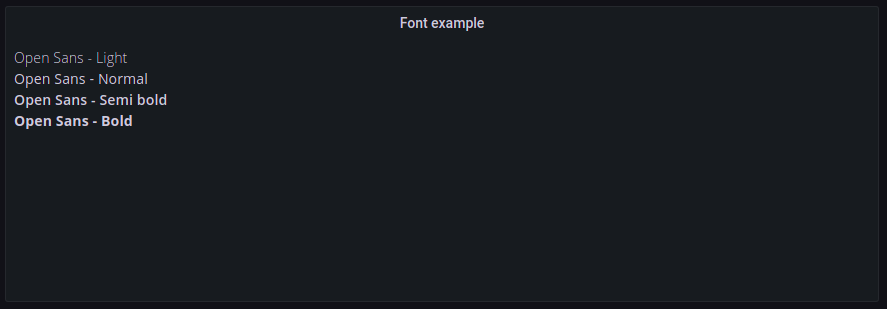

The panel loads the [Open Sans](https://fonts.google.com/specimen/Open+Sans) font.



`CSS`

```css
div {
  /*
    The Open Sans font is imported by the plugin,
    and is formatted as woff2, which means that it only supports modern browsers.

    If you want to support older browser, try using system fonts.
    A good blog about system fonts https://bitsofco.de/the-new-system-font-stack/

    The Open Sans font used - https://fonts.google.com/specimen/Open+Sans
    Browser support for woff2 - https://caniuse.com/#feat=woff2
  */
  font-family: 'Open Sans';
}
```

`HTML/SVG`

```html
<div>
  <!--
    Currently, light (300), regular (400), semi bold (600), and bold (800) is imported.

    Font weight - https://developer.mozilla.org/en-US/docs/Web/CSS/font-weight
   -->
  <span style="font-weight: 300">Open Sans - Light</span>
  <br />
  <span style="font-weight: 400">Open Sans - Normal</span>
  <br />
  <span style="font-weight: 600">Open Sans - Semi bold</span>
  <br />
  <span style="font-weight: 800">Open Sans - Bold</span>
</div>
```

`Panel options` (import/export)

```json
{
  "add100Percentage": true,
  "centerAlignContent": true,
  "overflow": "visible",
  "SVGBaseFix": true,
  "codeData": "{\n  \"text\": \"Random text\"\n}",
  "css": "div {\n  /*\n    The Open Sans font is imported by the plugin,\n    and is formatted as woff2, which means that it only supports modern browsers.\n\n    If you want to support older browser, try using system fonts.\n    A good blog about system fonts https://bitsofco.de/the-new-system-font-stack/\n\n    The Open Sans font used - https://fonts.google.com/specimen/Open+Sans\n    Browser support for woff2 - https://caniuse.com/#feat=woff2\n  */\n  font-family: 'Open Sans';\n}\n",
  "html": "<div>\n  <!--\n    Currently, light (300), regular (400), semi bold (600), and bold (800) is imported.\n\n    Font weight - https://developer.mozilla.org/en-US/docs/Web/CSS/font-weight\n   -->\n  <span style=\"font-weight: 300\">Open Sans - Light</span>\n  <br />\n  <span style=\"font-weight: 400\">Open Sans - Normal</span>\n  <br />\n  <span style=\"font-weight: 600\">Open Sans - Semi bold</span>\n  <br />\n  <span style=\"font-weight: 800\">Open Sans - Bold</span>\n</div>",
  "renderOnMount": true,
  "onRender": "",
  "dynamicData": false,
  "panelupdateOnMount": true,
  "onInit": ""
}
```
