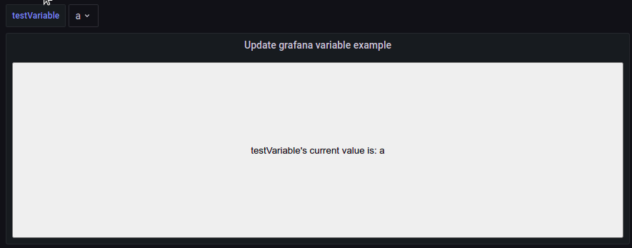
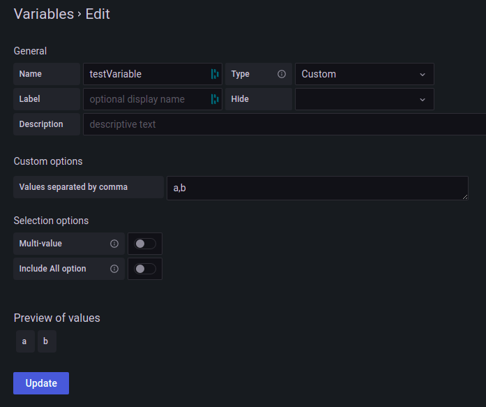

:::caution
For Grafana v8.3.0+ variables used by HTMLGraphics won't update when the variable is changed unless it's wrapped in `${}`.
:::



`HTML/SVG`

```html
<button></button>
```

`onInit`

```javascript
// For Grafana v8.3.0+ the variable needs to be wrapped in ${}
const { testVariable } = customProperties;
const testVariableName = testVariable.replace(/[${}]/g, '');
const buttonElt = htmlNode.querySelector('button');

/*
  Update a grafana variable

  More information in the grafana docs
  https://grafana.com/docs/grafana/latest/developers/plugins/add-support-for-variables/
*/
function updateGrafanaVariable(variableName, value) {
  getLocationSrv().update({
    query: {
      [`var-${variableName}`]: value,
    },
    partial: true, // partial: true makes the update only affect the query parameters listed in query, and leaves the other query parameters unchanged.
    replace: true, // replace: true tells Grafana to update the current URL state, rather than creating a new history entry.
  });
}

function getGrafanaVariableValue(variable) {
  return getTemplateSrv().replace(variable);
}

function updateButtonText() {
  buttonElt.textContent = `${testVariableName}'s current value is: ${getGrafanaVariableValue(testVariable)}`;
}

buttonElt.onclick = function () {
  updateGrafanaVariable(testVariableName, getGrafanaVariableValue(testVariable) == 'b' ? 'a' : 'b');
};

/*
  When the variable changes panelupdate will trigger.
  The panelupdate is used to update the button text so the text is the same as the variable.
*/
htmlNode.addEventListener('panelupdate', () => {
  updateButtonText();
});
```

`Custom properties`

```json
{
  "testVariable": "${testVariable}"
}
```

`Panel options` (import/export)

```json
{
  "calcsMutation": "standard",
  "reduceOptions": {
    "calcs": [
      "lastNotNull",
      "last",
      "first",
      "firstNotNull",
      "min",
      "max",
      "mean",
      "sum",
      "count",
      "range",
      "delta",
      "step",
      "diff",
      "logmin",
      "allIsZero",
      "allIsNull",
      "diffperc"
    ]
  },
  "add100Percentage": true,
  "centerAlignContent": true,
  "overflow": "visible",
  "SVGBaseFix": true,
  "codeData": "{\n  \"testVariable\": \"${testVariable}\"\n}",
  "rootCSS": "",
  "css": "",
  "html": "<button></button>\n",
  "renderOnMount": true,
  "onRender": "",
  "dynamicData": false,
  "dynamicHtmlGraphics": false,
  "dynamicFieldDisplayValues": false,
  "dynamicProps": false,
  "panelupdateOnMount": true,
  "onInitOnResize": false,
  "onInit": "// For Grafana v8.3.0+ the variable needs to be wrapped in ${}\nconst { testVariable } = customProperties;\nconst testVariableName = testVariable.replace(/[${}]/g, \"\");\nconst buttonElt = htmlNode.querySelector('button');\n\n/*\n  Update a grafana variable\n\n  More information in the grafana docs\n  https://grafana.com/docs/grafana/latest/developers/plugins/add-support-for-variables/\n*/\nfunction updateGrafanaVariable(variableName, value) {\n  getLocationSrv().update({\n    query: {\n      [`var-${variableName}`]: value,\n    },\n    partial: true, // partial: true makes the update only affect the query parameters listed in query, and leaves the other query parameters unchanged.\n    replace: true, // replace: true tells Grafana to update the current URL state, rather than creating a new history entry.\n  });\n}\n\nfunction getGrafanaVariableValue(variable) {\n  return getTemplateSrv().replace(variable);\n}\n\nfunction updateButtonText() {\n  buttonElt.textContent = `${testVariableName}'s current value is: ${getGrafanaVariableValue(testVariable)}`;\n}\n\nbuttonElt.onclick = function () {\n  updateGrafanaVariable(testVariableName, getGrafanaVariableValue(testVariable) == 'b' ? 'a' : 'b');\n};\n\n/*\n  When the variable changes panelupdate will trigger.\n  The panelupdate is used to update the button text so the text is the same as the variable.\n*/\nhtmlNode.addEventListener('panelupdate', () => {\n  updateButtonText();\n});\n"
}
```
