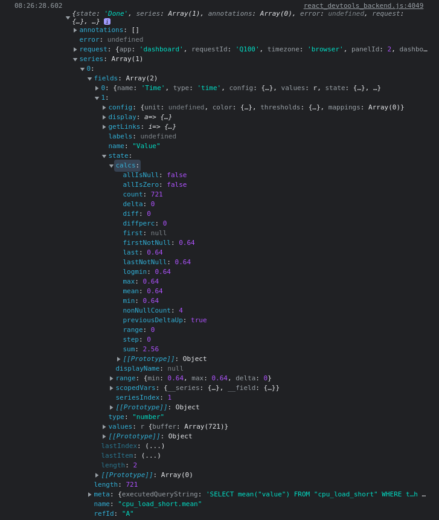
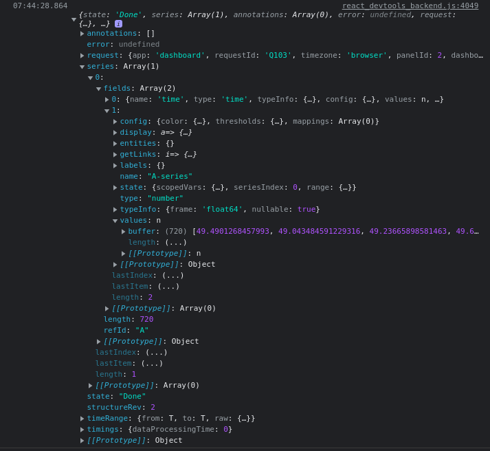

## Use a package

Use a package maintained by others.

The easiest way is to use the [grafana-metric](https://www.npmjs.com/package/@gapit/grafana-metric) with a [bundler](../projects.md#bundlers).

## Use the data object

Using the [data](./../references.md#data-global) might be a little confusing initially, but it's easier once you log the data object.

```javascript
console.log(data);
```

Some data sources only have values.



An example on how you could get the value from the data object above.

```javascript
const valueField = data.series[0].fields[1];
const length = valueField.values.length;
const value = valueField.values.get(length - 1);
console.log(value);
```

Some data sources have calcs (which is easier to work with).

:::caution
Not all data sources have calcs. Using the values is usually a safer choice.
:::



An example on how you could get the value from the data object above.

```javascript
const value = data.series[0].fields[1].state.calcs.last;
console.log(value);
```

This also works

```javascript
const valueField = data.series[0].fields[1];
const length = valueField.values.length;
const value = valueField.values.get(length - 1);
console.log(value);
```

With some checks to make sure the data exists and as a function.

```javascript
function getMetric(seriesName) {
  if (data.series < 0) return null;

  const series = data.series.find((series) => series.name === seriesName);
  const fields = series.fields;

  if (fields <= 1) return null;

  const valueField = fields[1];
  const length = valueField.values.length;

  if (length <= 0) return null;

  const value = valueField.values.get(length - 1);
  return value;
}

console.log(getMetric('seriesName'));
```
