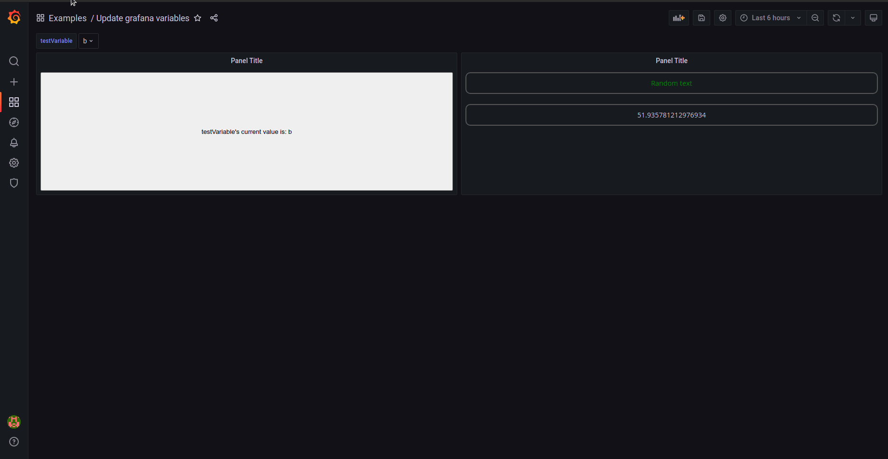
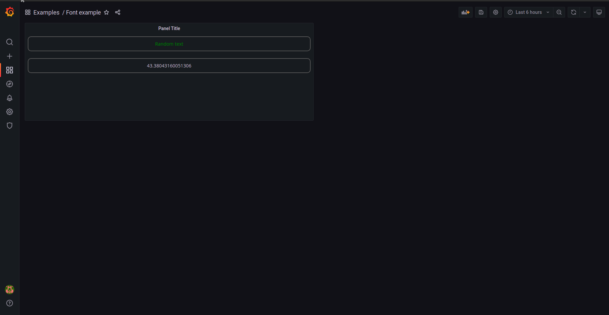

## Copy from one panel to another

1. Go to edit mode on the panel you want to copy from
2. Go to Import/export and copy the text in the editor `ctrl+a` `ctrl+c`
3. Go out of edit mode
4. Go to the edit mode you want to copy to
5. Go to Import/export and paste the text in the editor `ctrl+a` `ctrl+v`

## Import from a file

1. Go to edit mode on the panel you want to import the file to
2. Drag the file (or click `Choose file`) to the file drop area

