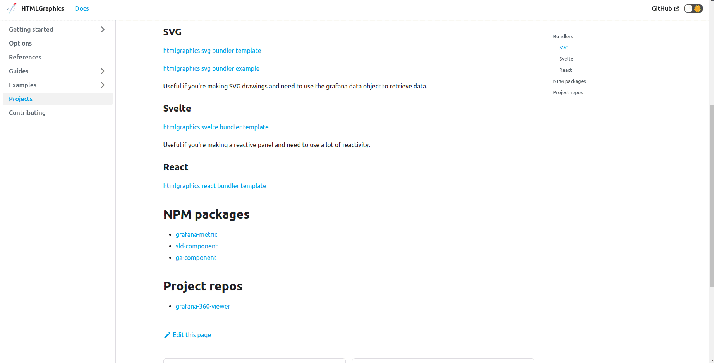

1. Find the template you want to use (example: https://github.com/gapitio/htmlgraphics-svg-bundler-template).
2. Click on `Use this template`.
3. Add the repo name to the empty input field (Repository name).
4. Clone the repo to your machine.

