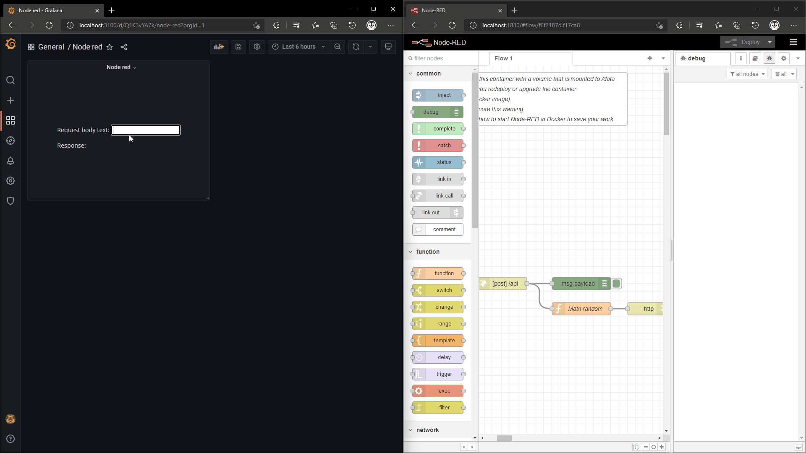

## GET requests through localhost

The easiest way to make a GET request is with [fetch](https://developer.mozilla.org/en-US/docs/Web/API/Fetch_API/Using_Fetch).

Example:

```js
fetch('https://swapi.dev/api/people/1/')
  .then((response) => response.json())
  .then((data) => console.log(data));
```

The problem with this method is that it requires the user to have access to the domain.

## GET requests through Grafana server with the JSON API plugin

With this the Grafana server is the only thing that needs access to the domain.

This requires the use of the [JSON API](https://grafana.com/grafana/plugins/marcusolsson-json-datasource/) plugin to send http requests from Grafana through the Grafana server. Follow the instructions on <https://marcus.se.net/grafana-json-datasource/configuration> on how to configure the data source.

And the way to get the data would be like other metrics [How to get metrics](how-to-get-metrics.md).

The problem with this is that the dashboard has to be refreshed to get the json response.

## GET requests through Grafana server with the JSON API plugin proxy

The [JSON API](https://grafana.com/grafana/plugins/marcusolsson-json-datasource/) plugin creates a proxy with the Grafana server to send HTTP requests. The proxy can be used to send HTTP requests from the panel without refreshing the dashboard.

JSON API config
URL = `https://swapi.dev/api`

<details><summary>Panel json</summary>
<p>

```json
{
  "calcsMutation": "none",
  "reduceOptions": {
    "calcs": []
  },
  "add100Percentage": false,
  "centerAlignContent": true,
  "overflow": "visible",
  "SVGBaseFix": true,
  "codeData": "{\n  \"text\": \"Random text\"\n}",
  "rootCSS": "",
  "css": "* {\n  font-family: Open Sans;\n}\n",
  "html": "<div>\n  <input value=\"1\" min=\"1\" type=\"number\"></input>\n  <p>Name: <span></span></p>\n<div>",
  "renderOnMount": true,
  "onRender": "",
  "dynamicHtmlGraphics": false,
  "dynamicData": false,
  "dynamicFieldDisplayValues": false,
  "dynamicProps": false,
  "panelupdateOnMount": true,
  "onInitOnResize": false,
  "onInit": "const inputElt = htmlNode.querySelector('input');\nconst spanElt = htmlNode.querySelector('span');\n\nfunction getDataSourceProxyURL(name) {\n  return Object.values(window.grafanaBootData.settings.datasources).find((dataSource) => dataSource.name === name).url;\n}\n\nconst starWarsAPIProxyURL = getDataSourceProxyURL('Star wars API');\n\nfunction updateName(peopleNr) {\n  const starWarsPeopleURL = `${starWarsAPIProxyURL}/people/${peopleNr}`;\n  fetch(starWarsPeopleURL, {\n    method: 'GET',\n  }).then((response) => response.json().then((value) => (spanElt.innerText = value.name)));\n}\n\ninputElt.oninput = () => {\n  updateName(inputElt.value);\n};\n\nupdateName(inputElt.value);"
}
```

</p>
</details>

`onInit`

```js
const inputElt = htmlNode.querySelector('input');
const spanElt = htmlNode.querySelector('span');

function getDataSourceProxyURL(name) {
  return Object.values(window.grafanaBootData.settings.datasources).find((dataSource) => dataSource.name === name).url;
}

const starWarsAPIProxyURL = getDataSourceProxyURL('Star wars API');

function updateName(peopleNr) {
  const starWarsPeopleURL = `${starWarsAPIProxyURL}/people/${peopleNr}`;
  fetch(starWarsPeopleURL, {
    method: 'GET',
  }).then((response) => response.json().then((value) => (spanElt.innerText = value.name)));
}

inputElt.oninput = () => {
  updateName(inputElt.value);
};

updateName(inputElt.value);
```

## POST requests through Grafana server with the JSON API plugin proxy



You can also use the proxy to send POST requests with data. This can be useful if you want to change a setpoint.

In the example below the Grafana instance is started with docker compose which means the JSON API configurations can vary based on how Grafana is started. The example below uses [node red](https://nodered.org/) for receiving post requests.

`docker-compose.yml` node red.

```yml
version: '3.7'

services:
  node-red:
    image: nodered/node-red:latest
    networks:
      - grafana
    ports:
      - 1880:1880
    volumes:
      - node-red-data:/data

volumes:
  node-red-data:

networks:
  grafana:
    external: true
    name: grafana
```

`docker-compose.yml` grafana.

```yml
version: '3.7'
services:
  grafana:
    image: grafana/grafana:8.3.3
    networks:
      - grafana
    volumes:
      - grafana-storage:/var/lib/grafana
    ports:
      - 3000:3000
    environment:
      - GF_INSTALL_PLUGINS=gapit-htmlgraphics-panel,marcusolsson-json-datasource

volumes:
  grafana-storage:

networks:
  grafana:
    external: true
    name: grafana
```

JSON API config
URL = `node-red:1880`

<details><summary>Node red flow</summary>
<p>

````json
[
  {
    "id": "f6f2187d.f17ca8",
    "type": "tab",
    "label": "Flow 1",
    "disabled": false,
    "info": ""
  },
  {
    "id": "3cc11d24.ff01a2",
    "type": "comment",
    "z": "f6f2187d.f17ca8",
    "name": "WARNING: please check you have started this container with a volume that is mounted to /data\\n otherwise any flow changes are lost when you redeploy or upgrade the container\\n (e.g. upgrade to a more recent node-red docker image).\\n  If you are using named volumes you can ignore this warning.\\n Double click or see info side panel to learn how to start Node-RED in Docker to save your work",
    "info": "\nTo start docker with a bind mount volume (-v option), for example:\n\n```\ndocker run -it -p 1880:1880 -v /home/user/node_red_data:/data --name mynodered nodered/node-red\n```\n\nwhere `/home/user/node_red_data` is a directory on your host machine where you want to store your flows.\n\nIf you do not do this then you can experiment and redploy flows, but if you restart or upgrade the container the flows will be disconnected and lost. \n\nThey will still exist in a hidden data volume, which can be recovered using standard docker techniques, but that is much more complex than just starting with a named volume as described above.",
    "x": 350,
    "y": 80,
    "wires": []
  },
  {
    "id": "59ff2a1.fa600d4",
    "type": "http in",
    "z": "f6f2187d.f17ca8",
    "name": "",
    "url": "/api",
    "method": "post",
    "upload": false,
    "swaggerDoc": "",
    "x": 380,
    "y": 520,
    "wires": [["75ead9333c673f05", "28ab76e4497ef6f4"]]
  },
  {
    "id": "08159b4df1824988",
    "type": "http response",
    "z": "f6f2187d.f17ca8",
    "name": "",
    "statusCode": "",
    "headers": {},
    "x": 730,
    "y": 580,
    "wires": []
  },
  {
    "id": "75ead9333c673f05",
    "type": "debug",
    "z": "f6f2187d.f17ca8",
    "name": "",
    "active": true,
    "tosidebar": true,
    "console": false,
    "tostatus": false,
    "complete": "payload",
    "targetType": "msg",
    "statusVal": "",
    "statusType": "auto",
    "x": 570,
    "y": 520,
    "wires": []
  },
  {
    "id": "28ab76e4497ef6f4",
    "type": "function",
    "z": "f6f2187d.f17ca8",
    "name": "Math random",
    "func": "\nmsg.payload = Math.random().toFixed(10);\n\nreturn msg;",
    "outputs": 1,
    "noerr": 0,
    "initialize": "",
    "finalize": "",
    "libs": [],
    "x": 570,
    "y": 580,
    "wires": [["08159b4df1824988"]]
  }
]
````

</p>
</details>

<details><summary>Panel json</summary>
<p>

```json
{
  "calcsMutation": "none",
  "reduceOptions": {
    "calcs": []
  },
  "add100Percentage": false,
  "centerAlignContent": true,
  "overflow": "visible",
  "SVGBaseFix": true,
  "codeData": "{\n  \"text\": \"Random text\"\n}",
  "rootCSS": "",
  "css": "* {\n  font-family: Open Sans;\n}\n\n.box {\n  border: solid #555 2px;\n  border-radius: 10px;\n  padding: 10px 20px;\n}\n",
  "html": "<div>\r\n  <p>Request body text: <input></input></p>\r\n  <p>Response: <span></span></p>\r\n<div>",
  "renderOnMount": true,
  "onRender": "",
  "dynamicHtmlGraphics": false,
  "dynamicData": false,
  "dynamicFieldDisplayValues": false,
  "dynamicProps": false,
  "panelupdateOnMount": true,
  "onInitOnResize": false,
  "onInit": "const inputElt = htmlNode.querySelector(\"input\");\nconst spanElt = htmlNode.querySelector(\"span\");\n\nfunction getDataSourceProxyURL(name) {\n  return Object.values(window.grafanaBootData.settings.datasources).find((dataSource) => dataSource.name === name).url;\n}\n\nconst nodeRedAPIProxyURL = getDataSourceProxyURL('Node red API');\n\nfunction sendPostRequest() {\n  const nodeRedAPIURL = `${nodeRedAPIProxyURL}/api`;\n  const body = inputElt.value;\n  fetch(nodeRedAPIURL, {\n    method: 'POST',\n    body\n  }).then((response) => response.text().then(value => spanElt.innerText = value));\n}\n\ninputElt.oninput = () => {\n  sendPostRequest()\n}\n"
}
```

</p>
</details>

`onInit`

```js
const inputElt = htmlNode.querySelector('input');
const spanElt = htmlNode.querySelector('span');

function getDataSourceProxyURL(name) {
  return Object.values(window.grafanaBootData.settings.datasources).find((dataSource) => dataSource.name === name).url;
}

const nodeRedAPIProxyURL = getDataSourceProxyURL('Node red API');

function sendPostRequest() {
  const nodeRedAPIURL = `${nodeRedAPIProxyURL}/api`;
  const body = inputElt.value;
  fetch(nodeRedAPIURL, {
    method: 'POST',
    body,
  }).then((response) => response.text().then((value) => (spanElt.innerText = value)));
}

inputElt.oninput = () => {
  sendPostRequest();
};
```
