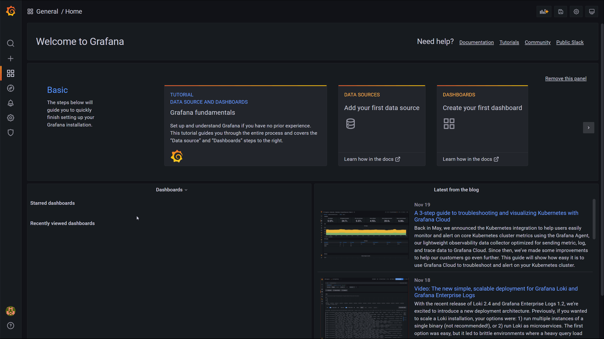

import Tabs from '@theme/Tabs';
import TabItem from '@theme/TabItem';
import CodeBlock from '@theme/CodeBlock';
import { htmlGraphics } from '@site/config.js';

:::info
For a more detailed explaination on how to install plugins, check out https://grafana.com/docs/grafana/v9.1/plugins/installation/
:::

## Install using the plugin catalog

:::caution
Plugin catalog came out in v8.0 of Grafana.
:::

:::info
More information about plugin catalog https://grafana.com/docs/grafana/v9.1/plugins/catalog/
:::

Configuration > Plugins > HTML Graphics



## Install using grafana-cli

:::info
More information about grafana-cli https://grafana.com/docs/grafana/v9.1/administration/cli/
:::

To install the latest version of the plugin, run the following command on the Grafana server:

<Tabs
  groupId="operating-systems"
  defaultValue="linux"
  values={[
    {label: 'Linux', value: 'linux'},
    {label: 'macOS', value: 'macos'},
    {label: 'Windows', value: 'windows'},
  ]}>

  <TabItem value="linux">

<Tabs
  groupId="version"
  defaultValue="latest"
  values={[
    {label: 'Latest (Grafana)', value: 'latest'},
    {label: 'Latest (Github)', value: 'latest-github'},
    {label: 'Specific version', value: 'specific'},
  ]}>

  <TabItem value="latest">

```bash
grafana-cli plugins install gapit-htmlgraphics-panel
```

  </TabItem>

  <TabItem value="latest-github">

<CodeBlock className="language-bash">
  grafana-cli --pluginUrl {htmlGraphics.latestReleaseUrl} plugins install gapit-htmlgraphics-panel
</CodeBlock>

  </TabItem>

  <TabItem value="specific">

The specific version link can be obtained by copying the asset link from [Releases](https://github.com/gapitio/gapit-htmlgraphics-panel/releases) on the GitHub project page

<CodeBlock className="language-bash">
  grafana-cli --pluginUrl {htmlGraphics.releaseUrl()} plugins install gapit-htmlgraphics-panel
</CodeBlock>

  </TabItem>
</Tabs>

  </TabItem>
  <TabItem value="macos">

<Tabs
  groupId="version"
  defaultValue="latest"
  values={[
    {label: 'Latest (Grafana)', value: 'latest'},
    {label: 'Latest (Github)', value: 'latest-github'},
    {label: 'Specific version', value: 'specific'},
  ]}>

  <TabItem value="latest">

```bash
grafana-cli plugins install gapit-htmlgraphics-panel
```

  </TabItem>

  <TabItem value="latest-github">

<CodeBlock className="language-bash">
  grafana-cli --pluginUrl {htmlGraphics.latestReleaseUrl} plugins install gapit-htmlgraphics-panel
</CodeBlock>

  </TabItem>

  <TabItem value="specific">

The specific version link can be obtained by copying the asset link from [Releases](https://github.com/gapitio/gapit-htmlgraphics-panel/releases) on the GitHub project page

<CodeBlock className="language-bash">
  grafana-cli --pluginUrl {htmlGraphics.releaseUrl()} plugins install gapit-htmlgraphics-panel
</CodeBlock>

  </TabItem>
</Tabs>

  </TabItem>
  <TabItem value="windows">

<Tabs
  groupId="version"
  defaultValue="latest"
  values={[
    {label: 'Latest (Grafana)', value: 'latest'},
    {label: 'Latest (Github)', value: 'latest-github'},
    {label: 'Specific version', value: 'specific'},
  ]}>

  <TabItem value="latest">

```bash
grafana-cli.exe plugins install gapit-htmlgraphics-panel
```

  </TabItem>

  <TabItem value="latest-github">

<CodeBlock className="language-bash">
  grafana-cli.exe --pluginUrl {htmlGraphics.latestReleaseUrl} plugins install gapit-htmlgraphics-panel
</CodeBlock>

  </TabItem>

  <TabItem value="specific">

The specific version link can be obtained by copying the asset link from [Releases](https://github.com/gapitio/gapit-htmlgraphics-panel/releases) on the GitHub project page

<CodeBlock className="language-bash">
  grafana-cli.exe --pluginUrl {htmlGraphics.releaseUrl()} plugins install gapit-htmlgraphics-panel
</CodeBlock>

  </TabItem>
</Tabs>

  </TabItem>
</Tabs>

## Install manually

1.  Go to [Releases](https://github.com/gapitio/gapit-htmlgraphics-panel/releases) on the GitHub project page
2.  Find the release you want to install
3.  Download the release by clicking the release asset called `gapit-htmlgraphics-panel-<version>.zip`. You may need to uncollapse the **Assets** section to see it.
4.  Unarchive the plugin into the Grafana plugins directory

<Tabs
  groupId="operating-systems"
  defaultValue="linux"
  values={[
    {label: 'Linux', value: 'linux'},
    {label: 'macOS', value: 'macos'},
    {label: 'Windows', value: 'windows'},
  ]}>

  <TabItem value="linux">

```bash
unzip gapit-htmlgraphics-panel-<version>.zip
mv gapit-htmlgraphics-panel /var/lib/grafana/plugins
```

  </TabItem>

  <TabItem value="macos">

```bash
unzip gapit-htmlgraphics-panel-<version>.zip
mv gapit-htmlgraphics-panel /usr/local/var/lib/grafana/plugins
```

  </TabItem>

  <TabItem value="windows">

```bash
Expand-Archive -Path gapit-htmlgraphics-panel-<version>.zip -DestinationPath C:\grafana\data\plugins
```

  </TabItem>

</Tabs>

5.  Restart the Grafana server to load the plugin

## Docker compose

<Tabs
  groupId="version"
  defaultValue="latest"
  values={[
    {label: 'Latest (Grafana)', value: 'latest'},
    {label: 'Latest (Github)', value: 'latest-github'},
    {label: 'Specific version', value: 'specific'},
  ]}>

  <TabItem value="latest">

```yaml
version: '3'
services:
  grafana:
    image: grafana/grafana
    container_name: grafana
    restart: always
    networks:
      - grafana
    ports:
      - 3000:3000
    environment:
      - GF_INSTALL_PLUGINS=gapit-htmlgraphics-panel

networks:
  grafana:
    name: grafana
```

  </TabItem>

  <TabItem value="latest-github">

<CodeBlock className="language-yaml">
{`version: '3'
services:
  grafana:
    image: grafana/grafana
    container_name: grafana
    restart: always
    networks:
      - grafana
    ports:
      - 3000:3000
    environment:
      - GF_INSTALL_PLUGINS=${htmlGraphics.latestReleaseUrl};gapit-htmlgraphics-panel\n
networks:
  grafana:
    name: grafana`}
</CodeBlock>

  </TabItem>

  <TabItem value="specific">

The specific version link can be obtained by copying the asset link from [Releases](https://github.com/gapitio/gapit-htmlgraphics-panel/releases) on the GitHub project page

<CodeBlock className="language-yaml">
{`version: '3'
services:
  grafana:
    image: grafana/grafana
    container_name: grafana
    restart: always
    networks:
      - grafana
    ports:
      - 3000:3000
    environment:
      - GF_INSTALL_PLUGINS=${htmlGraphics.releaseUrl()};gapit-htmlgraphics-panel # v${htmlGraphics.version}\n
networks:
  grafana:
    name: grafana`}
</CodeBlock>

  </TabItem>
</Tabs>
