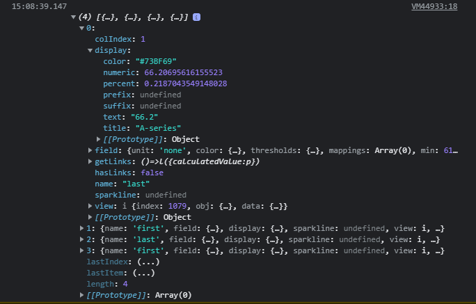
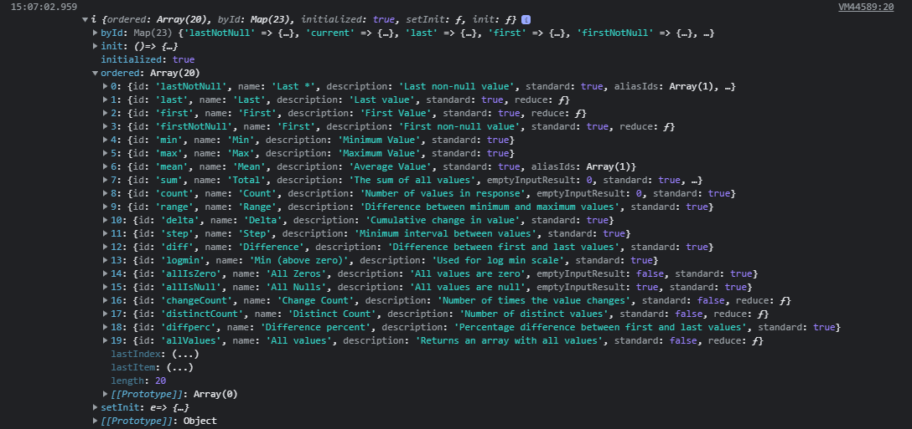

:::warning
All references are in htmlGraphics, but not every reference is global.
:::

The plugin makes several references to the HTML/SVG document and Grafana in the execution context of onRender and onInit functions/javascript. Below are details for each. Remember, you can always use the [developer console](https://developers.google.com/web/tools/chrome-devtools/console) (ctrl+shift+j) and [console.log()](https://developer.mozilla.org/en-US/docs/Web/API/Console/log).

```javascript
// Log this in onRender or onInit, and look at developer console (ctrl+shift+j).
console.log('htmlGraphics', htmlGraphics);
```

## htmlGraphics (global)

An object (dict) containing all the variables.

### htmlNode

The [ShadowRoot](https://developer.mozilla.org/en-US/docs/Web/API/ShadowRoot) which contains the elements added in the HTML/SVG document (works similarly to document).

Used to get elements and their properties.

```javascript
const randomTextElt = htmlGraphics.htmlNode.querySelector('#random-text-elt');
randomTextElt.textContent = 'Something';
randomTextElt.style.fill = '#08f';
```

### data

The [PanelData interface](https://grafana.com/docs/grafana/v9.1/packages_api/data/paneldata/) passed into the panel by Grafana.

Can be used to retrieve metric values.

```javascript
// Used in onRender as it updates every time new data is available
const getMetricByName = (metricName, noDataValue = 'No data') => {
  const filteredSeries = htmlGraphics.data.series.filter((series) => series.name == metricName);
  if (filteredSeries.length > 0) {
    return filteredSeries[0].fields[1].state.calcs.last;
  }
  return noDataValue;
};

getMetricByName('random-metric-name');
```

### customProperties

The parsed json object _(also available as a JSON string in options.codeData)_ from the Custom properties option _(named codeData in the options for backwards compatibility)_.

Used to get the json object values.

`Custom properties`

```json
{
  "something": true
}
```

```javascript
// onRender or onInit

console.log(htmlGraphics.customProperties.something); // true
```

### codeData

:::caution
codeData is deprecated. Use customProperties instead.
:::

Same as [customProperties](#customproperties-global)

`Custom properties`

```json
{
  "something": true
}
```

```javascript
// onRender or onInit

console.log(htmlGraphics.codeData.something); // true
```

### options

The options object.

```javascript
console.log(htmlGraphics.options);

// Looks something like this, when logged in the console.

{
  SVGBaseFix: true,
  add100Percentage: true,
  centerAlignContent: true,
  codeData: "{\"randomKey\": \"randomValue\"}",
  css: undefined,
  html: undefined,
  onInit: "console.log(options)",
  onRender: undefined,
  ...
}
```

### theme

The [GrafanaTheme](https://grafana.com/docs/grafana/v9.1/packages_api/data/grafanatheme/) object. It stores the current theme (light/dark), colors used by grafana, ETC.

Very useful when you're making a dark mode and light mode.

```javascript
const darkTheme = () => {
  ...
};

if (htmlGraphics.theme.isDark) {
  darkTheme();
}
```

### theme2

The new [GrafanaTheme2](https://grafana.com/docs/grafana/v9.1/packages_api/data/grafanatheme2/) object introduced in Grafana v8. It stores the current theme (light/dark), colors used by grafana, ETC.

```javascript
console.log(htmlGraphics.theme2);
```

### getTemplateSrv

Used to retrieve the [TemplateSrv](https://grafana.com/docs/grafana/v9.1/packages_api/runtime/templatesrv/) that can be used to fetch available template variables.

```javascript
htmlGraphics.getTemplateSrv().replace(`$randomVariable`);
```

### ~~getLocationSrv~~

_Deprecated in favor of [locationService](#locationservice)_

Used to retrieve the [LocationSrv](https://grafana.com/docs/grafana/v9.1/packages_api/runtime/locationsrv/) that can be used to update the template variables.

```javascript
htmlGraphics.getLocationSrv().update({
  query: {
    'var-randomVariable': 'randomValue',
  },
  partial: true,
  replace: false,
});
```

### locationService

A wrapper to help work with browser location and history

```javascript
htmlGraphics.locationService.partial(
  {
    'var-randomVariable': 'randomValue',
  },
  true // replace: true tells Grafana to update the current URL state, rather than creating a new history entry.
);
```

### props

Containing all the props from the panel [panelprops](https://grafana.com/docs/grafana/v9.1/packages_api/data/panelprops/)

```javascript
console.log(htmlGraphics.props);
```

### width

The width of the panel

```javascript
console.log(htmlGraphics.width);
```

### height

The height of the panel

```javascript
console.log(htmlGraphics.height);
```

### getFieldDisplayValues

This is the same command which is used for mutating calcs in the Value options [Mutate calcs](./options.md#mutate-calcs).

This command returns a list of the values specified in the reduceOptions.

_If nothing is specified it will use the same options as the [Mutate calcs](./options.md#mutate-calcs) and [props](#props)_

```js
console.log(htmlGraphics.getFieldDisplayValues({ reduceOptions: { calcs: ['last', 'first'] } }));
```



### fieldDisplayValues

[Mutate calcs](./options.md#mutate-calcs) uses [getFieldDisplayValues](#getFieldDisplayValues) to mutate the calcs and this is the returned values.

```js
console.log(htmlGraphics.fieldDisplayValues);
```

### fieldReducers

A list of the reducers.

Useful for checking the calcs properties.

```js
console.log(htmlGraphics.fieldReducers);
```



## htmlNode (global)

The [ShadowRoot](https://developer.mozilla.org/en-US/docs/Web/API/ShadowRoot) which contains the elements added in the HTML/SVG document (works similarly to document).

Used to get elements and their properties.

```javascript
const randomTextElt = htmlNode.querySelector('#random-text-elt');
randomTextElt.textContent = 'Something';
randomTextElt.style.fill = '#08f';
```

### panelupdate event

`panelupdate` triggers when new data is available (like onRender).

```js
function onPanelUpdate() {
  console.log(data);
}

htmlNode.addEventListener('panelupdate', onPanelUpdate); // Triggers when new data is available (like onRender)
htmlNode.onpanelupdate = onPanelUpdate; // A function that triggers at the same time as the panelupdate event
```

Because of the panelupdate event, frameworks like [React](https://reactjs.org/), [Svelte](https://svelte.dev/), ETC are easier to work with. Check out the [Bundlers](./projects.md#bundlers) for more information.

### panelwillunmount event

`panelwillunmount` triggers when the panel will unmount [componentWillUnmount](https://reactjs.org/docs/react-component.html#componentwillunmount).

```js
function onPanelWillUnmount() {
  console.log('Bye');
}

htmlNode.addEventListener('panelwillunmount', onPanelWillUnmount);
htmlNode.onpanelwillunmount = onPanelWillUnmount;
```

## customProperties (global)

The parsed json object _(also available as a JSON string in options.codeData)_ from the Custom properties option _(named codeData in the options for backwards compatibility)_.

Used to get the json object values.

`Custom properties`

```json
{
  "something": true
}
```

```javascript
// onRender or onInit

console.log(customProperties.something); // true
```

## codeData (global)

:::caution
codeData is deprecated. Use customProperties instead.
:::

Same as [customProperties](#customproperties-global)

`Custom properties`

```json
{
  "something": true
}
```

```javascript
// onRender or onInit

console.log(codeData.something); // true
```

## data (global)

The [PanelData interface](https://grafana.com/docs/grafana/v9.1/packages_api/data/paneldata/) passed into the panel by Grafana.

Can be used to retrieve metric values.

```javascript
// Used in onRender as it updates every time new data is available
const getMetricByName = (metricName, noDataValue = 'No data') => {
  const filteredSeries = data.series.filter((series) => series.name == metricName);
  if (filteredSeries.length > 0) {
    return filteredSeries[0].fields[1].state.calcs.last;
  }
  return noDataValue;
};

getMetricByName('random-metric-name');
```

## options (global)

The options object.

```javascript
console.log(options);

// Looks something like this, when logged in the console.

{
  SVGBaseFix: true,
  add100Percentage: true,
  centerAlignContent: true,
  codeData: "{\"randomKey\": \"randomValue\"}",
  css: undefined,
  html: undefined,
  onInit: "console.log(options)",
  onRender: undefined,
  ...
}
```

## theme (global)

The [GrafanaTheme](https://grafana.com/docs/grafana/v9.1/packages_api/data/grafanatheme/) object. It stores the current theme (light/dark), colors used by grafana, ETC.

Very useful when you're making a dark mode and light mode.

```javascript
const darkTheme = () => {
  ...
};

if (theme.isDark) {
  darkTheme();
}
```

## getTemplateSrv (global)

Used to retrieve the [TemplateSrv](https://grafana.com/docs/grafana/v9.1/packages_api/runtime/templatesrv/) that can be used to fetch available template variables.

```javascript
getTemplateSrv().replace(`$randomVariable`);
```

## ~~getLocationSrv (global)~~

_Deprecated in favor of [locationService](#locationservice)_

Used to retrieve the [LocationSrv](https://grafana.com/docs/grafana/v9.1/packages_api/runtime/locationsrv/) that can be used to update the template variables.

```javascript
getLocationSrv().update({
  query: {
    'var-randomVariable': 'randomValue',
  },
  partial: true,
  replace: false,
});
```
