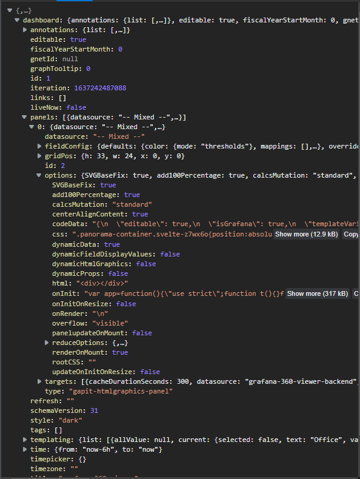
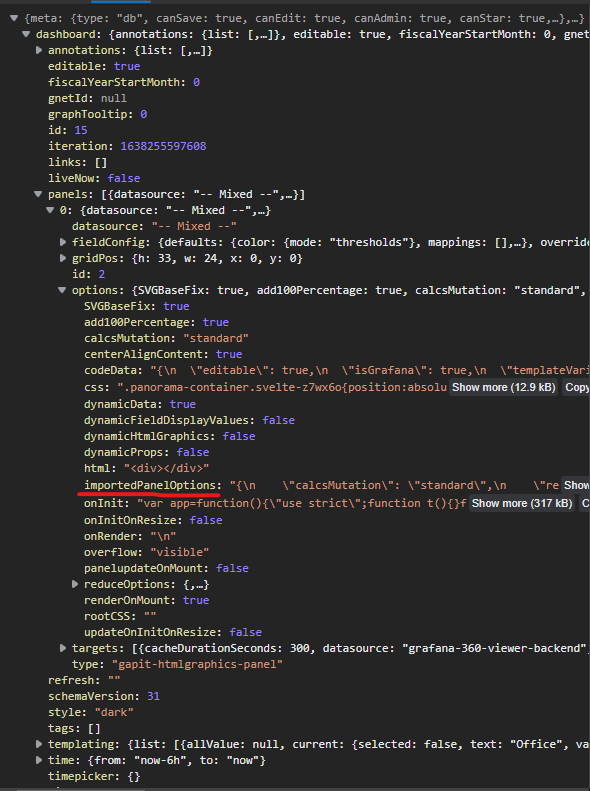
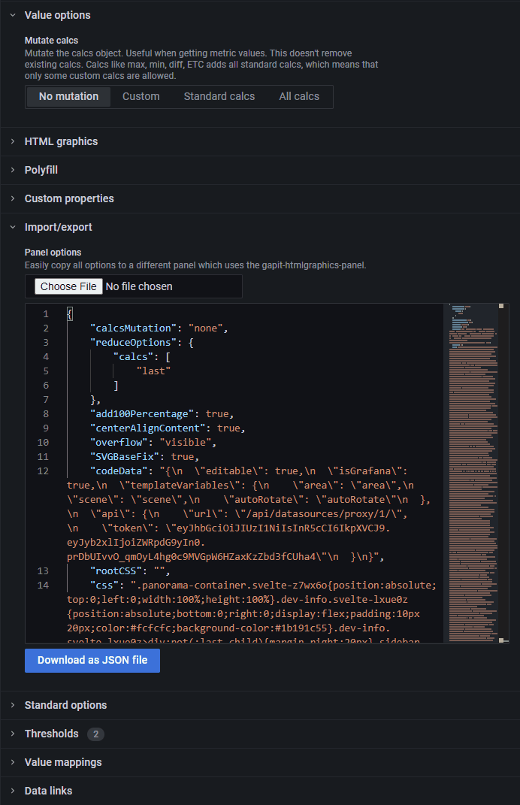
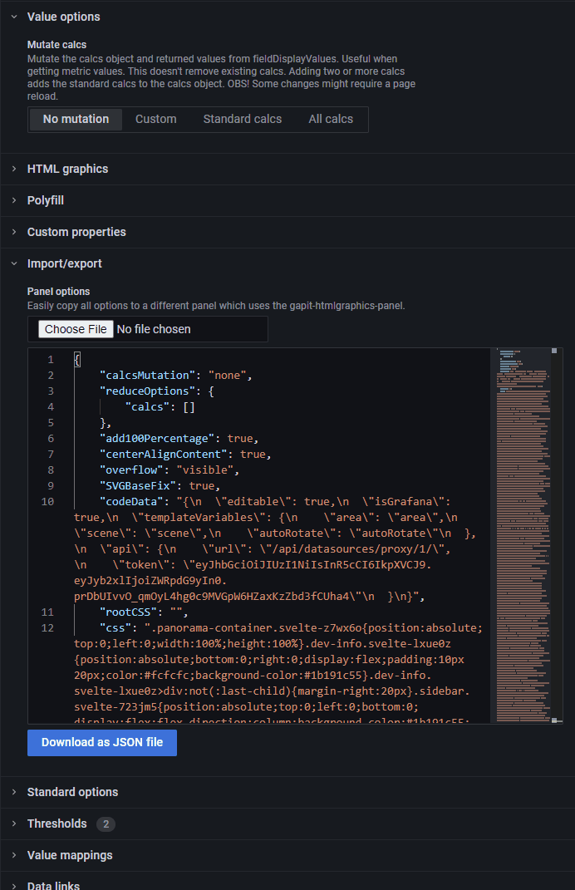

### Halved the saved options

:::caution
Breaking change! `importedPanelOptions` doesn't save in the options after v2.0.0.
:::

:::caution
Panels created after updating to v2.0.0 will have the halved size, but plugins created before v2.0.0 must have it's `importedPanelOptions` updated. To update `importedPanelOptions` go to the [Import/export](options.md#importexport) option and update the json (add a space at the bottom of the editor) and save (ctrl+s).
:::

The `importedPanelOptions` doesn't save as it's own option anymore, but just updates the other options. Which almost halves the size of the saved panel options.

The grafana dashboard payload for v2.0.0 (all the data, not just the saved panel options)

The grafana dashboard payload for version v1.5.0

### Improvements to the mutate calcs options

A bug was fixed where import/export didn't update with the latest mutate calcs options when mutate calcs changed.

All the calcs which are in use are shown in the calcs option.

v1.5.0

v2.0.0

