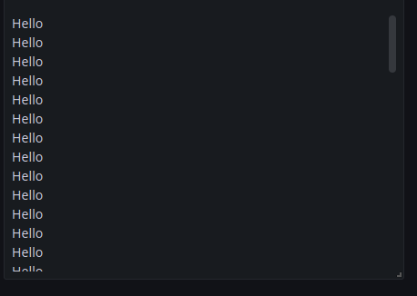
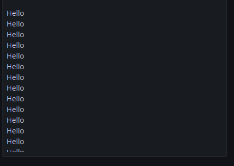
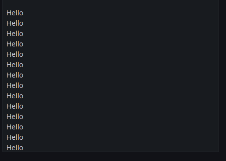
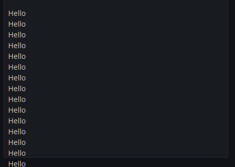

### Grafana scrollbar

Grafana scrollbar (left image is hover)




Without Grafana scrollbar (left image is after Grafana v9.0.3 ([related PR](https://github.com/grafana/grafana/pull/52167)))




### locationService

[getLocationSrv](../references.md#gettemplatesrv) is deprecated in favor of [locationService](../references.md#locationservice)

Updating grafana variables using [locationService](../references.md#locationservice)

```javascript
htmlGraphics.locationService.partial(
  {
    [`var-${variableName}`]: value,
  },
  true // replace: true tells Grafana to update the current URL state, rather than creating a new history entry.
);
```

Old way using [getLocationSrv](../references.md#gettemplatesrv)

```javascript
htmlGraphics.getLocationSrv().update({
  query: {
    [`var-${variableName}`]: value,
  },
  partial: true, // partial: true makes the update only affect the query parameters listed in query, and leaves the other query parameters unchanged.
  replace: true, // replace: true tells Grafana to update the current URL state, rather than creating a new history entry.
});
```

### Minor tweaks

Some changes has been made to the declarations used for type hinting/suggestions when writing in the onRender and onInit options. Which should make the declarations more accurate.
