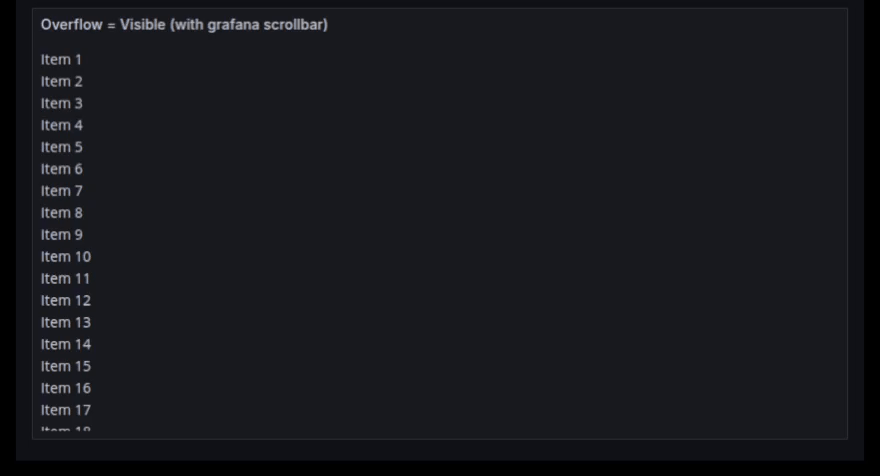
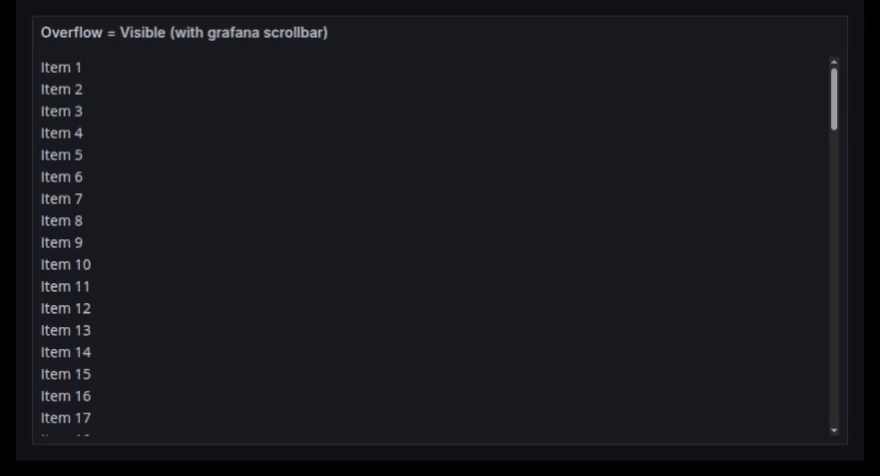
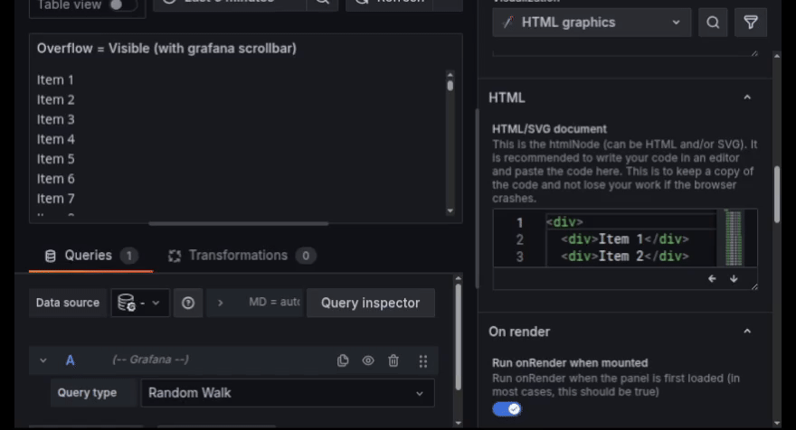
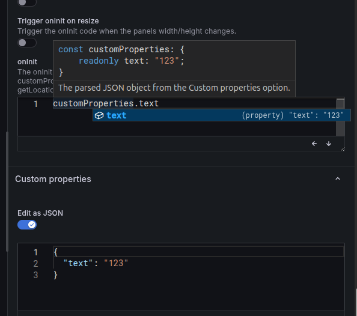
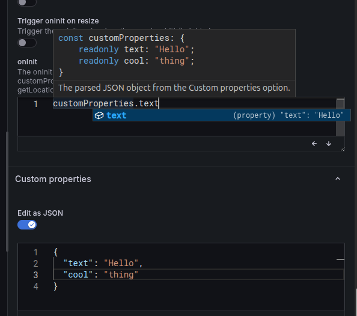

### Add new scrollbar

The old scrollbar named `CustomScrollbar` in `@grafana/ui` has been deprecated and replaced by `ScrollContainer`.
Relevant Grafana PR: [#96331](https://github.com/grafana/grafana/pull/96331)

The new `ScrollContainer` only works for Grafana v9.5.0 or later. Earlier versions will still use the old `CustomScrollbar`.

Old `CustomScrollbar`:



New `ScrollContainer`:



The new scrollbar has some shading at the top and bottom of the container when the content is scrolled.

There isn't an option to remove the shading, but the scrollbar is just (excluding the shading):

```css
:host > div {
  overflow: auto; /* This is overwritten by the Overflow option value */
  scrollbar-width: thin;
}
```

So to have a scrollbar similar to Grafana's scrollbar without the shading. Set the `Overflow` option to `Auto` and add the following CSS:

```css
:host > div {
  scrollbar-width: thin;
}
```

### Adjustable code editor height

The code editor height can now be adjusted/resized with the buttons or by dragging the bottom right corner of the code editor.



### Sync Custom properties with the type declarations in onInit and onRender

The type hints in the `onInit` and `onRender` code editors are now synced with the custom properties defined in the `Custom properties` option.
Changes made to the custom properties will automatically update the type declarations in the code editors.

Grafana version v8.4.0 to v9.1.X has some issues with dynamically updating the type declarations in the code editor. Which is fixed in Grafana v9.2.0.
For these versions, the type declarations will only be updated when the code editor is reloaded (f5).




### Minor tweaks

- The code editor doesn't wait for the type declarations to load before loading the code editor. (Faster loading).
- The code editor doesn't cause layout shift once the code editor is loaded. (Less jumping around when the code editor loads).
- The code editor has a smaller default height making scrolling easier.
